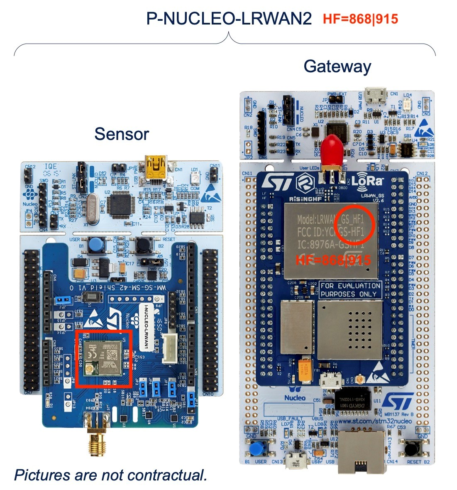
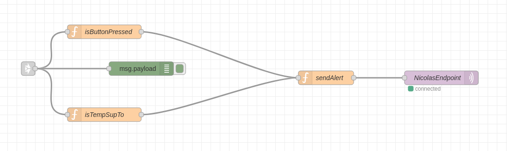

# Rapport technique

## Matériel et outils

Pour ce projet nous avons codé sur un kit P_NUCLEO_LRWAN2. 

Nous avons codé sur l'IDE STM32CubeIDE.

## Objectifs

Le but de ce mini-projet était d'implémenter un système d'alarme qui se déclenche soit lors de l'appuie sur un bouton soit lorsque la température capté par le endpoint est supérieure à un certain seuil. Nous avons défini ce seuil à 60°C. 

### Réalisation

#### Node RED

Nous avons créé un nouveau flow Node RED qui prend en entrée le message envoyé par le endpoint. Nous traitons ensuite ce message pour vérifier les données captées par les capteurs de celui-ci, notamment si le bouton a été pressé et la température. Si le bouton s'avère avoir été pressé ou si la température dépasse 60°C un message est construit pour indiquer que la sirène doit être déclenché.

#### Code C

Le code de notre projet est écrit en C, il permet d'envoyer de passer l'état du bouton à 1 lorsque celui-ci est appuyé pour l'envoyé par message. Ce code permet égalament d'allumer une LED verte lorsque le bouton est appuyé afin d'avoir un retour direct.
